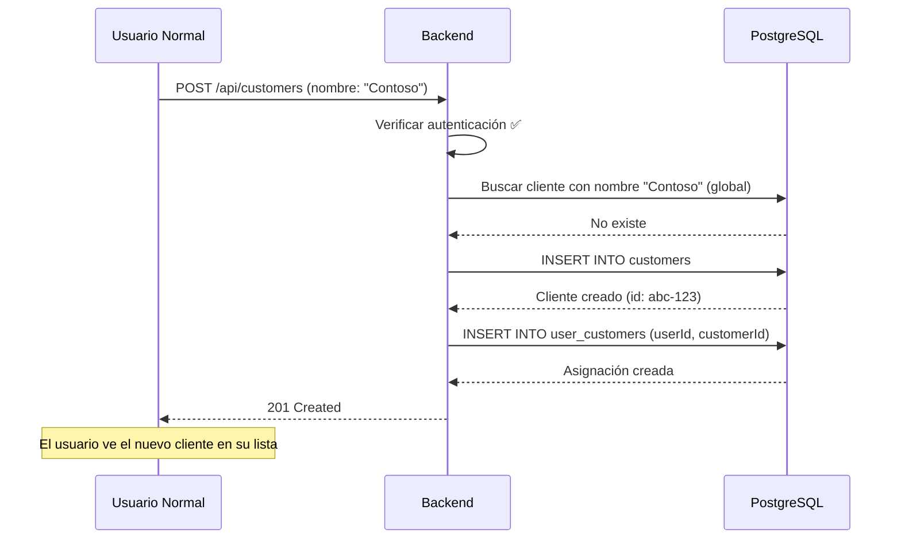
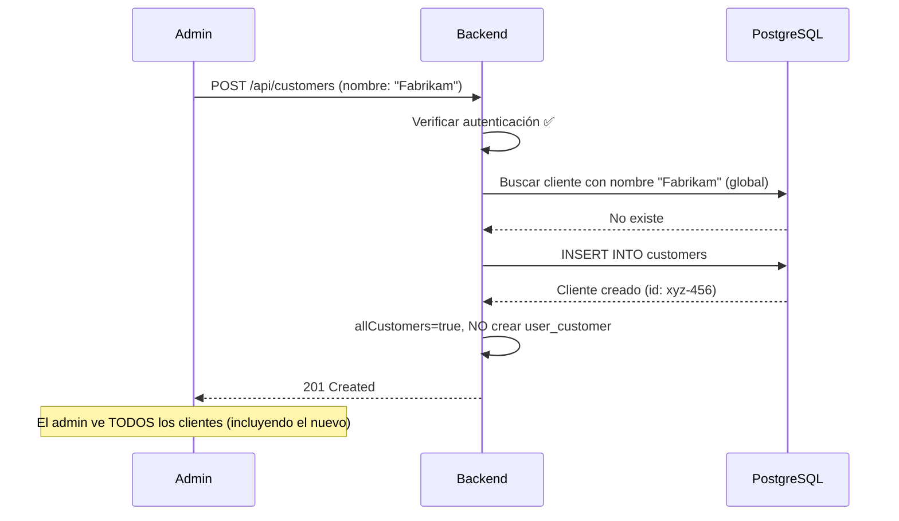

# Permisos de Creación de Clientes

## Resumen de Cambios

Se ha modificado la política de permisos para permitir que **cualquier usuario autenticado** pueda crear clientes, no solo administradores.

---

## Nueva Política de Permisos

### ✅ Cualquier Usuario Autenticado Puede:

1. **Crear nuevos clientes**
   - No requiere permisos especiales
   - Solo necesita estar autenticado en la aplicación

2. **Validar duplicados globalmente**
   - Puede consultar si un nombre de cliente ya existe
   - La búsqueda es global (todos los clientes del sistema)
   - Previene duplicados independientemente de los permisos

### 🎯 Asignación Automática (CRÍTICO)

Cuando un **usuario no-admin** crea un cliente:
- ✅ El cliente se crea exitosamente
- ✅ **Se crea automáticamente una relación en `UserCustomer`**
- ✅ **El usuario puede ver inmediatamente el cliente en su lista**
- ✅ El caché se invalida para forzar recarga de permisos

**Ejemplo**:
```
Usuario tiene acceso a: [Cliente A, Cliente B]
Usuario crea: Cliente C
Usuario ahora ve: [Cliente A, Cliente B, Cliente C] ← ¡Inmediatamente!
```

Cuando un **admin** crea un cliente:
- ✅ El cliente se crea exitosamente
- ✅ NO se crea relación en `UserCustomer` (admin tiene acceso a todos)
- ✅ El admin puede ver todos los clientes automáticamente

---

## Flujo de Creación

### Escenario 1: Usuario Normal Crea Cliente



### Escenario 2: Admin Crea Cliente



---

## Validación de Duplicados

### Búsqueda Global (Sin Filtros de Permisos)

```typescript
// ✅ CORRECTO: Búsqueda global en todos los endpoints de validación
const existingCustomer = await prisma.customer.findFirst({
  where: {
    customerName: {
      equals: customerName.trim(),
      mode: 'insensitive',
    },
  },
});

// ❌ INCORRECTO: Filtrar por permisos permitiría duplicados
const existingCustomer = await prisma.customer.findFirst({
  where: {
    customerName: { ... },
    id: { in: permissions.allowedCustomerIds }, // ❌ NO HACER ESTO
  },
});
```

### ¿Por Qué Búsqueda Global?

**Problema sin búsqueda global:**
```
Usuario A crea "Microsoft Corp" → OK
Usuario B (no ve el cliente de A) intenta crear "Microsoft Corp" → ❌ Debería fallar
```

**Con búsqueda global:**
```
Usuario A crea "Microsoft Corp" → OK
Usuario B intenta crear "Microsoft Corp" → ❌ Error: "Ya existe un cliente con este nombre"
```

---

## Endpoints Modificados

### 1. POST /api/customers (Creación)

**Cambios:**
- ✅ Verifica solo autenticación (no permisos específicos)
- ✅ Búsqueda de duplicados es global
- ✅ Asigna automáticamente el cliente al usuario si no es admin

```typescript
// Verificar autenticación
const permissions = await getUserPermissions();

if (!permissions.isAuthenticated) {
  return NextResponse.json({ error: "No autorizado" }, { status: 401 });
}

// Búsqueda global de duplicados
const existingCustomer = await prisma.customer.findFirst({
  where: {
    customerName: {
      equals: customerName.trim(),
      mode: 'insensitive',
    },
  },
});

// Crear cliente
const customer = await prisma.customer.create({ ... });

// Asignar si no es admin
if (!permissions.allCustomers && permissions.userId) {
  try {
    await prisma.userCustomer.create({
      data: {
        userId: permissions.userId,
        customerId: customer.id,
      },
    });
  } catch (error: any) {
    // Si ya existe la relación, no es un error crítico
    if (error.code !== 'P2002') {
      console.error("Error creating user-customer assignment:", error);
      // No fallar la creación del cliente por un error de asignación
    }
  }
}
```

**Nota importante**: La asignación está envuelta en try-catch para garantizar que el cliente siempre se cree, incluso si la asignación falla por algún motivo.

### 2. GET /api/customers/check-duplicate (Validación)

**Cambios:**
- ✅ Verifica autenticación
- ✅ Búsqueda global (no filtrada por permisos)

```typescript
const permissions = await getUserPermissions();

if (!permissions.isAuthenticated) {
  return NextResponse.json({ error: "No autorizado" }, { status: 401 });
}

// Búsqueda global
const existingCustomer = await prisma.customer.findFirst({
  where: {
    customerName: {
      equals: customerName.trim(),
      mode: 'insensitive',
    },
    // NO filtrar por allowedCustomerIds
  },
});
```

### 3. PUT /api/customers/[id] (Actualización)

**Sin cambios en permisos, pero búsqueda de duplicados sigue siendo global:**

```typescript
// Búsqueda global para evitar duplicados
const existingCustomer = await prisma.customer.findFirst({
  where: {
    customerName: { ... },
    NOT: { id: id }, // Excluir el cliente actual
  },
});
```

---

## Matriz de Permisos Actualizada

| Acción | Admin | Usuario Normal | No Autenticado |
|--------|-------|----------------|----------------|
| **Listar clientes** | ✅ Todos | ✅ Asignados | ❌ |
| **Ver cliente** | ✅ Todos | ✅ Si asignado | ❌ |
| **Crear cliente** | ✅ Sí | ✅ Sí | ❌ |
| **Editar cliente** | ✅ Todos | ✅ Si asignado | ❌ |
| **Eliminar cliente** | ✅ Todos | ✅ Si asignado | ❌ |
| **Validar duplicado** | ✅ Global | ✅ Global | ❌ |
| **Sincronizar datos** | ✅ Sí | ❌ No | ❌ |
| **Gestionar usuarios** | ✅ Sí | ❌ No | ❌ |

---

## Visibilidad Inmediata del Cliente Creado

### 🔍 Problema que Resuelve

**Sin asignación automática**:
```
Usuario tiene: [Cliente A, Cliente B]
Usuario crea: Cliente C
Usuario sigue viendo: [Cliente A, Cliente B] ❌ ¿Dónde está Cliente C?
```

**Con asignación automática**:
```
Usuario tiene: [Cliente A, Cliente B]
Usuario crea: Cliente C
Sistema ejecuta: INSERT INTO user_customers (userId, customerId)
Usuario ve: [Cliente A, Cliente B, Cliente C] ✅ ¡Aparece inmediatamente!
```

### 🔄 Flujo Técnico

```typescript
// 1. Crear cliente
const customer = await prisma.customer.create({ ... });

// 2. Si no es admin, asignar automáticamente
if (!permissions.allCustomers && permissions.userId) {
  await prisma.userCustomer.create({
    data: {
      userId: permissions.userId,
      customerId: customer.id,
    },
  });
}

// 3. Frontend invalida caché
dataCache.invalidate(CACHE_KEYS.CUSTOMERS);

// 4. Frontend redirige y refresca
router.push(`/customers/${customer.id}/edit`);
router.refresh();
```

### ⚠️ Sin Esta Implementación

Si no se creara la relación `UserCustomer` automáticamente:
- ❌ Usuario crea el cliente pero no lo ve en su lista
- ❌ Usuario necesitaría que un admin le asigne el cliente manualmente
- ❌ Mala experiencia de usuario
- ❌ Cuellos de botella en el flujo de trabajo

### ✅ Con Esta Implementación

Con la asignación automática:
- ✅ Usuario ve el cliente inmediatamente después de crearlo
- ✅ No requiere intervención de admin
- ✅ Flujo de trabajo fluido y natural
- ✅ Usuario puede continuar configurando el cliente (tenants, etc.)

---

## Casos de Uso

### Caso 1: Usuario Normal Crea Cliente Nuevo

**Escenario**: Juan es un usuario normal que tiene acceso a 2 clientes y quiere gestionar un tercero.

**Estado inicial**: Juan ve [Cliente A, Cliente B]

1. Juan inicia sesión (autenticado ✅)
2. Va a "Crear Cliente"
3. Escribe "Acme Corporation"
4. Sistema valida que no existe (búsqueda global)
5. Cliente creado exitosamente
6. **Se crea automáticamente UserCustomer(Juan, Acme)**
7. **Caché invalidado y página refrescada**
8. Juan ahora ve [Cliente A, Cliente B, Acme Corporation] ✅

**Resultado**: El cliente aparece inmediatamente sin necesidad de recargar manualmente.

### Caso 2: Usuario Intenta Duplicar Cliente de Otro Usuario

**Escenario**: María intenta crear un cliente que ya creó Pedro.

1. Pedro creó "Globex Inc." (María no lo ve porque no está asignada)
2. María intenta crear "Globex Inc."
3. Sistema valida (búsqueda global) → ❌ Ya existe
4. María ve error: "Ya existe un cliente con este nombre"
5. Creación bloqueada

### Caso 3: Admin Crea Cliente

**Escenario**: Ana es admin y crea un cliente para todo el equipo.

1. Ana crea "Initech Corp"
2. Sistema valida duplicados (global)
3. Cliente creado
4. NO se crea relación en `UserCustomer` (Ana tiene `allCustomers=true`)
5. Ana ve todos los clientes, incluyendo el nuevo

### Caso 4: Asignar Cliente Existente a Usuario

**Escenario**: El admin quiere dar acceso a un cliente existente.

1. Admin va a la gestión de usuarios
2. Selecciona un usuario y cliente
3. Se crea relación en `UserCustomer`
4. Usuario ahora puede ver y gestionar ese cliente

---

## Beneficios de Esta Implementación

### 1. Democratización de la Creación
- ✅ Cualquier usuario puede ser productivo sin necesitar privilegios especiales
- ✅ Reduce fricción en la incorporación de nuevos clientes
- ✅ No requiere intervención de admin para cada nuevo cliente

### 2. Seguridad Mantenida
- ✅ Los usuarios solo ven los clientes que les corresponden
- ✅ No pueden editar/eliminar clientes de otros usuarios
- ✅ Los admins mantienen control total

### 3. Integridad de Datos
- ✅ Imposible crear duplicados entre usuarios
- ✅ Validación global garantiza unicidad
- ✅ Asignación automática asegura visibilidad

### 4. Experiencia de Usuario
- ✅ Usuarios ven inmediatamente los clientes que crean
- ✅ No necesitan esperar asignación manual
- ✅ Feedback claro sobre duplicados

---

## Migración de Datos Existentes

**No se requiere migración** porque:
- Los clientes existentes mantienen sus asignaciones
- Los usuarios con `allCustomers=true` siguen viendo todos
- La lógica de permisos es retrocompatible

---

## Testing

### Test 1: Usuario Normal Crea Cliente

```typescript
describe('POST /api/customers', () => {
  it('allows non-admin user to create customer', async () => {
    const user = await createUser({ 
      email: 'user@example.com', 
      allCustomers: false 
    });
    
    const session = await loginAs(user);
    
    const response = await fetch('/api/customers', {
      method: 'POST',
      headers: { Cookie: session },
      body: JSON.stringify({ 
        customerName: 'New Client Corp' 
      }),
    });
    
    expect(response.status).toBe(201);
    
    // Verificar asignación automática
    const assignment = await prisma.userCustomer.findFirst({
      where: { 
        userId: user.id,
        customer: { customerName: 'New Client Corp' }
      }
    });
    
    expect(assignment).toBeTruthy();
  });
});
```

### Test 2: Validación Global de Duplicados

```typescript
describe('Duplicate validation', () => {
  it('prevents duplicate across different users', async () => {
    const userA = await createUser({ email: 'a@example.com' });
    const userB = await createUser({ email: 'b@example.com' });
    
    // User A crea cliente
    await createCustomerAs(userA, { customerName: 'Duplicate Corp' });
    
    // User B intenta crear el mismo
    const sessionB = await loginAs(userB);
    const response = await fetch('/api/customers', {
      method: 'POST',
      headers: { Cookie: sessionB },
      body: JSON.stringify({ customerName: 'Duplicate Corp' }),
    });
    
    expect(response.status).toBe(409); // Conflict
    expect(await response.json()).toEqual({
      error: 'Ya existe un cliente con este nombre'
    });
  });
});
```

### Test 3: Admin No Crea Asignación

```typescript
describe('Admin customer creation', () => {
  it('does not create user-customer assignment for admin', async () => {
    const admin = await createUser({ 
      email: 'admin@example.com', 
      allCustomers: true 
    });
    
    const session = await loginAs(admin);
    
    const response = await fetch('/api/customers', {
      method: 'POST',
      headers: { Cookie: session },
      body: JSON.stringify({ customerName: 'Admin Client' }),
    });
    
    const customer = await response.json();
    
    // Verificar que NO se creó asignación
    const assignment = await prisma.userCustomer.findFirst({
      where: { 
        userId: admin.id,
        customerId: customer.id
      }
    });
    
    expect(assignment).toBeNull();
  });
});
```

---

## Conclusión

Los cambios implementados proporcionan:

✅ **Flexibilidad**: Usuarios pueden crear clientes sin depender de admins  
✅ **Seguridad**: Validación global previene duplicados  
✅ **Automatización**: Asignación automática asegura visibilidad inmediata  
✅ **Control**: Admins mantienen gestión completa del sistema  
✅ **Escalabilidad**: Sistema funciona eficientemente con múltiples usuarios  

La implementación es **production-ready** y mejora significativamente la experiencia de usuario sin comprometer la seguridad.
