# Prevención de Clientes Duplicados

## Resumen

Se ha implementado una solución completa de prevención de clientes duplicados que funciona en tres capas: Base de datos, Backend y Frontend.

## Implementación por Capas

### 1. Base de Datos (PostgreSQL + Prisma)

**Archivo**: `prisma/schema.prisma`

Se agregó una restricción de unicidad (`@unique`) al campo `customerName` del modelo `Customer`:

```prisma
model Customer {
  id                  String             @id @default(dbgenerated("gen_random_uuid()")) @db.Uuid
  customerName        String             @unique @db.VarChar(50)  // ✅ UNIQUE constraint
  imageBase64         String?
  infraestructureType InfrastructureType @default(Saas)
  description         String?
  tenants             Tenant[]
  allowedUsers        UserCustomer[]

  @@map("customers")
}
```

**Beneficios**:
- Garantiza integridad a nivel de base de datos
- Previene duplicados incluso si se bypasea la aplicación
- PostgreSQL maneja la comparación de forma eficiente

**Migración aplicada**:
```bash
npx prisma db push
```

---

### 2. Backend (Next.js API Routes)

#### 2.1 Política de Permisos

**IMPORTANTE**: 
- ✅ **Cualquier usuario autenticado** puede crear clientes (no solo admins)
- ✅ **La validación de duplicados** consulta TODOS los clientes globalmente
- ✅ **Los usuarios no-admin** se asignan automáticamente a los clientes que crean
- ⚠️ **La visualización de clientes** sigue respetando los permisos individuales

Esto asegura que:
1. No se puedan crear duplicados sin importar los permisos del usuario
2. Los usuarios pueden crear clientes sin necesitar privilegios de admin
3. Los usuarios ven automáticamente los clientes que crean

#### 2.1 Endpoint de Creación (`POST /api/customers`)

**Archivo**: `app/api/customers/route.ts`

**Validaciones implementadas**:

1. **Verificación de autenticación** (cualquier usuario autenticado puede crear):
   ```typescript
   const permissions = await getUserPermissions();

   if (!permissions.isAuthenticated) {
     return NextResponse.json(
       { error: "No autorizado" },
       { status: 401 }
     );
   }
   ```

2. **Validación explícita antes de crear** (búsqueda global):
   ```typescript
   // IMPORTANTE: Esta búsqueda es GLOBAL (no filtrada por permisos)
   const existingCustomer = await prisma.customer.findFirst({
     where: {
       customerName: {
         equals: customerName.trim(),
         mode: 'insensitive', // Ignorar mayúsculas/minúsculas
       },
     },
   });

   if (existingCustomer) {
     return NextResponse.json(
       { error: "Ya existe un cliente con este nombre" },
       { status: 409 } // Conflict
     );
   }
   ```

3. **Asignación automática para usuarios no-admin**:
   ```typescript
   // Si el usuario NO tiene acceso a todos los clientes,
   // asignarlo automáticamente al cliente que acaba de crear
   if (!permissions.allCustomers && permissions.userId) {
     await prisma.userCustomer.create({
       data: {
         userId: permissions.userId,
         customerId: customer.id,
       },
     });
   }
   ```

4. **Manejo de error de Prisma (fallback)**:
   ```typescript
   const existingCustomer = await prisma.customer.findFirst({
     where: {
       customerName: {
         equals: customerName.trim(),
         mode: 'insensitive', // Case-insensitive
       },
     },
   });

   if (existingCustomer) {
     return NextResponse.json(
       { error: "Ya existe un cliente con este nombre" },
       { status: 409 } // Conflict
     );
   }
   ```

2. **Manejo de error de Prisma (fallback)**:
   ```typescript
   catch (error: any) {
     if (error.code === 'P2002') { // Unique constraint violation
       return NextResponse.json(
         { error: "Ya existe un cliente con este nombre" },
         { status: 409 }
       );
     }
   }
   ```

**Ventajas**:
- Respuesta amigable antes de intentar insertar
- Doble capa de seguridad (validación + constraint)
- Status code HTTP 409 (Conflict) semánticamente correcto

---

#### 2.2 Endpoint de Actualización (`PUT /api/customers/[id]`)

**Archivo**: `app/api/customers/[id]/route.ts`

**Validación implementada**:
```typescript
const existingCustomer = await prisma.customer.findFirst({
  where: {
    customerName: {
      equals: customerName.trim(),
      mode: 'insensitive',
    },
    NOT: {
      id: id, // ✅ Excluir el cliente actual
    },
  },
});
```

**Características**:
- Permite mantener el mismo nombre al editar
- Previene conflictos con otros clientes
- Manejo de errores de Prisma (P2002, P2025)

---

#### 2.3 Endpoint de Verificación (`GET /api/customers/check-duplicate`)

**Archivo**: `app/api/customers/check-duplicate/route.ts`

**Nuevo endpoint optimizado**:
```typescript
GET /api/customers/check-duplicate?name=NombreCliente&excludeId=uuid
```

**Características**:
- ✅ Requiere autenticación (cualquier usuario autenticado puede validar)
- ✅ **Búsqueda GLOBAL**: Consulta todos los clientes sin filtrar por permisos
- ✅ Previene duplicados entre todos los usuarios

**Parámetros**:
- `name` (requerido): Nombre del cliente a verificar
- `excludeId` (opcional): ID del cliente a excluir (útil en modo edición)

**Respuesta**:
```json
{
  "exists": true,
  "customer": {
    "id": "uuid",
    "customerName": "Nombre Exacto"
  }
}
```

**Ventajas sobre GET /api/customers**:
- ✅ Consulta más eficiente (solo busca duplicados)
- ✅ No carga datos innecesarios
- ✅ Reducción de transferencia de datos
- ✅ Mejor separación de responsabilidades

---

### 3. Frontend (React + TypeScript)

**Archivo**: `modules/customers/pages/CustomerFormPage.tsx`

#### 3.1 Estados de Validación

```typescript
const [checkingDuplicate, setCheckingDuplicate] = useState(false);
const [duplicateError, setDuplicateError] = useState<string>("");
```

#### 3.2 Validación en Tiempo Real con Debounce

```typescript
useEffect(() => {
  const checkDuplicateName = async () => {
    const trimmedName = formData.customerName.trim();
    
    // Validaciones previas
    if (!trimmedName) return;
    if (isEditMode && customer && 
        trimmedName.toLowerCase() === customer.customerName.toLowerCase()) {
      return;
    }

    setCheckingDuplicate(true);
    
    const params = new URLSearchParams({ name: trimmedName });
    if (isEditMode && customerId) {
      params.append('excludeId', customerId);
    }
    
    const response = await fetch(`/api/customers/check-duplicate?${params}`);
    const data = await response.json();
    
    if (data.exists) {
      setDuplicateError("Ya existe un cliente con este nombre");
    } else {
      setDuplicateError("");
    }
    
    setCheckingDuplicate(false);
  };

  const timeoutId = setTimeout(checkDuplicateName, 500); // Debounce 500ms
  return () => clearTimeout(timeoutId);
}, [formData.customerName, customerId, isEditMode, customer]);
```

**Características**:
- ⏱️ **Debounce de 500ms**: Evita validaciones excesivas mientras el usuario escribe
- 🔄 **Indicador visual de carga**: Spinner mientras verifica
- ⚠️ **Mensaje de error en tiempo real**: Feedback inmediato
- ✅ **Valida en creación y edición**: Lógica adaptativa según el contexto

---

#### 3.3 UI del Campo de Nombre

```tsx
<div className="relative">
  <input
    type="text"
    required
    value={formData.customerName}
    onChange={(e) =>
      setFormData({ ...formData, customerName: e.target.value })
    }
    className={`w-full px-2.5 sm:px-3 py-1.5 sm:py-2 border ${
      duplicateError 
        ? 'border-red-500 dark:border-red-400 focus:ring-red-500' 
        : 'border-gray-300 dark:border-gray-600 focus:ring-blue-500'
    } ...`}
    placeholder="Ingresa el nombre del cliente"
  />
  
  {/* Spinner de validación */}
  {checkingDuplicate && (
    <div className="absolute right-2.5 top-1/2 -translate-y-1/2">
      <svg className="animate-spin h-4 w-4 text-gray-400" ...>
        {/* SVG del spinner */}
      </svg>
    </div>
  )}
</div>

{/* Mensaje de error */}
{duplicateError && (
  <p className="mt-1 text-xs text-red-600 dark:text-red-400 flex items-center gap-1">
    <svg className="w-3.5 h-3.5" ...>
      {/* Icono de alerta */}
    </svg>
    {duplicateError}
  </p>
)}
```

**Estados visuales**:
- 🟢 **Normal**: Borde gris
- 🔵 **Validando**: Spinner a la derecha
- 🔴 **Duplicado**: Borde rojo + mensaje de error

---

#### 3.4 Prevención de Envío

```typescript
const handleSubmit = async (e: React.FormEvent) => {
  e.preventDefault();
  
  // ✅ Bloquear submit si hay error de duplicado
  if (duplicateError) {
    setError(duplicateError);
    return;
  }
  
  // ... continuar con el guardado
};
```

**Botón de guardar deshabilitado**:
```tsx
<button
  type="submit"
  disabled={loading || checkingDuplicate || !!duplicateError}
  ...
>
```

---

## Flujo de Validación

### Escenario: Usuario crea un nuevo cliente


### Escenario: Usuario intenta duplicar

```mermaid
sequenceDiagram
    participant U as Usuario
    participant F as Frontend
    participant API as Backend API
    participant DB as PostgreSQL

    U->>F: Escribe "Contoso" (ya existe)
    Note over F: Espera 500ms
    F->>API: GET /api/customers/check-duplicate?name=Contoso
    API->>DB: SELECT WHERE customerName = 'contoso'
    DB-->>API: ✅ Existe
    API-->>F: { exists: true, customer: {...} }
    F->>U: 🔴 "Ya existe un cliente con este nombre"
    
    U->>F: Intenta hacer submit (botón deshabilitado)
    Note over F: Submit bloqueado
```



---

## Casos de Prueba

### ✅ Casos que deben funcionar:

1. **Crear cliente con nombre único**
   - Input: "Empresa Nueva"
   - Resultado: Cliente creado exitosamente

2. **Editar cliente manteniendo el mismo nombre**
   - Input: "Contoso" → "Contoso"
   - Resultado: Actualización exitosa

3. **Editar cliente cambiando a nombre único**
   - Input: "Contoso" → "Fabrikam"
   - Resultado: Actualización exitosa

4. **Case-insensitive**
   - Input: "contoso" cuando existe "Contoso"
   - Resultado: ❌ Duplicado detectado

5. **Espacios al inicio/final**
   - Input: " Contoso " cuando existe "Contoso"
   - Resultado: ❌ Duplicado detectado (trim aplicado)

---

### ❌ Casos que deben fallar:

1. **Crear cliente con nombre existente**
   - Input: "Contoso" (ya existe)
   - Resultado: Error 409 Conflict

2. **Editar cliente a nombre existente**
   - Input: "Fabrikam" → "Contoso" (existe otro)
   - Resultado: Error 409 Conflict

3. **Bypass de validación frontend**
   - API: POST /api/customers con nombre duplicado
   - Resultado: Error 409 (protección backend)

4. **Bypass de validación backend**
   - DB: INSERT con nombre duplicado
   - Resultado: PostgreSQL Unique Constraint Violation

---

## Ventajas de la Implementación

### 🛡️ Seguridad en Capas (Defense in Depth)

```
Frontend Validation → Backend Validation → Database Constraint
     (UX)                  (Logic)              (Data Integrity)
```

### ⚡ Performance

- Validación asíncrona con debounce (reduce llamadas innecesarias)
- Endpoint dedicado (más rápido que cargar todos los clientes)
- Consulta case-insensitive en PostgreSQL (nativo y eficiente)

### 🎨 UX Mejorada

- Feedback inmediato al usuario
- Indicador visual de validación en progreso
- Mensajes de error claros y específicos
- Prevención de envíos inválidos

### 🔧 Mantenibilidad

- Lógica centralizada en el backend
- Código reutilizable (endpoint check-duplicate)
- Tipos TypeScript aseguran consistencia
- Separación clara de responsabilidades

---

## Mejoras Futuras (Opcional)

1. **Normalización de nombres**:
   ```typescript
   const normalize = (name: string) => 
     name.trim().toLowerCase().replace(/\s+/g, ' ');
   ```

2. **Búsqueda fonética** (para evitar variaciones como "Microsoft" vs "Microsof"):
   - Implementar algoritmo Soundex o Metaphone

3. **Sugerencias de nombres**:
   ```typescript
   if (duplicate) {
     return { 
       exists: true, 
       suggestion: `${name} - Copy`, 
       customer: duplicate 
     };
   }
   ```

4. **Auditoría de intentos de duplicación**:
   - Registrar intentos de crear duplicados en una tabla de logs

5. **Rate limiting**:
   - Limitar validaciones por usuario para evitar abuso

---

## Testing

### Unit Tests (Backend)

```typescript
// app/api/customers/__tests__/route.test.ts
describe('POST /api/customers', () => {
  it('should reject duplicate customer names', async () => {
    await createCustomer({ customerName: 'Test Corp' });
    
    const res = await fetch('/api/customers', {
      method: 'POST',
      body: JSON.stringify({ customerName: 'Test Corp' })
    });
    
    expect(res.status).toBe(409);
    expect(await res.json()).toEqual({ 
      error: 'Ya existe un cliente con este nombre' 
    });
  });
  
  it('should be case-insensitive', async () => {
    await createCustomer({ customerName: 'TestCorp' });
    
    const res = await fetch('/api/customers', {
      method: 'POST',
      body: JSON.stringify({ customerName: 'testcorp' })
    });
    
    expect(res.status).toBe(409);
  });
});
```

### Integration Tests (Frontend)

```typescript
// modules/customers/__tests__/CustomerFormPage.test.tsx
describe('CustomerFormPage', () => {
  it('should show duplicate error in real-time', async () => {
    render(<CustomerFormPage />);
    
    const input = screen.getByPlaceholderText('Ingresa el nombre del cliente');
    fireEvent.change(input, { target: { value: 'Existing Corp' } });
    
    await waitFor(() => {
      expect(screen.getByText('Ya existe un cliente con este nombre')).toBeInTheDocument();
    }, { timeout: 600 });
  });
  
  it('should disable submit button when duplicate detected', async () => {
    render(<CustomerFormPage />);
    
    const input = screen.getByPlaceholderText('Ingresa el nombre del cliente');
    fireEvent.change(input, { target: { value: 'Existing Corp' } });
    
    await waitFor(() => {
      const submitButton = screen.getByText('Crear cliente');
      expect(submitButton).toBeDisabled();
    });
  });
});
```

---

## Conclusión

La implementación proporciona una solución robusta que:

✅ Garantiza integridad de datos a nivel de base de datos  
✅ Valida correctamente en el backend con doble capa de seguridad  
✅ Ofrece excelente UX con validación en tiempo real  
✅ Maneja correctamente casos edge (case-insensitive, espacios, edición)  
✅ Es eficiente y escalable  
✅ Sigue mejores prácticas de desarrollo web  

La solución es **production-ready** y no requiere cambios adicionales para funcionar correctamente en producción.
